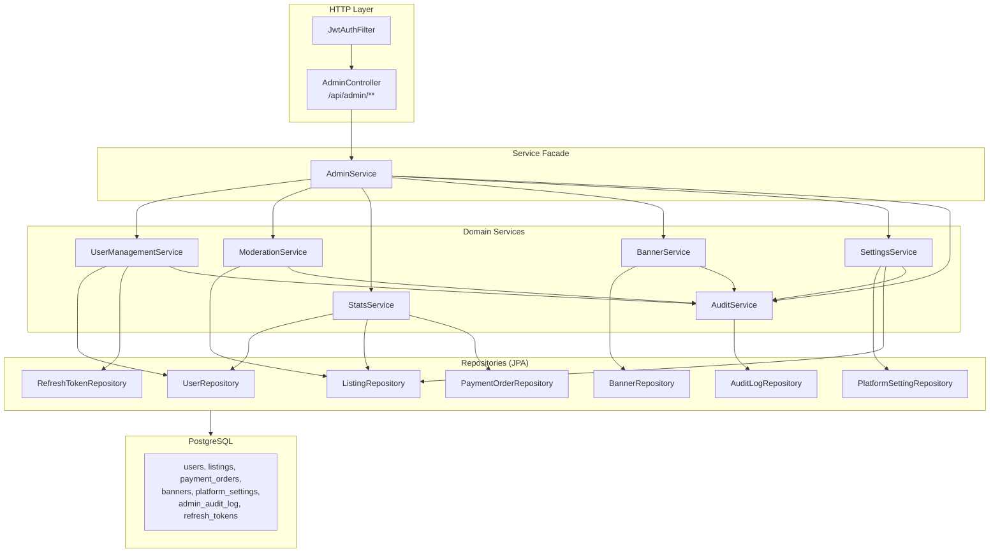
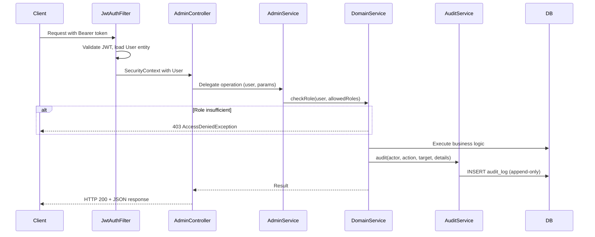
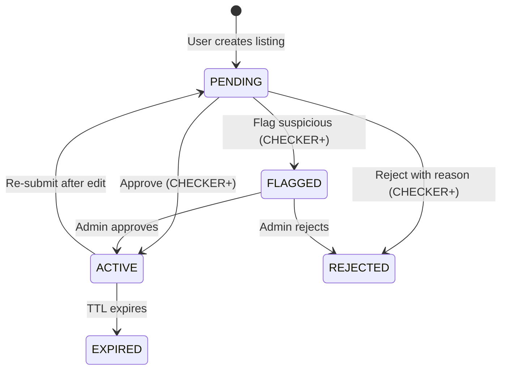

# Design Document: Admin Panel & Authorization System (Backend)

## Overview

This design covers the backend implementation of the Admin Panel for Deal Spot (ಡೀಲ್ ಸ್ಪಾಟ್), a rural agricultural marketplace. The system provides role-based access control (RBAC) with 4 roles (SUPER_ADMIN, ADMIN, CHECKER, USER), a listing moderation workflow with state machine enforcement, revenue/analytics dashboards, user management, platform ads/banners, configurable settings, and an immutable audit trail.

The architecture is a Spring Boot application (JPA/Hibernate + PostgreSQL) with stateless JWT authentication. Role enforcement happens at the service layer via `UserManagementService.checkRole()`. The `AdminController` serves as the single HTTP entry point for all admin operations, delegating to an `AdminService` facade which coordinates domain services.

### Key Design Decisions

1. **Facade pattern for admin operations** — `AdminService` acts as a thin coordination layer over domain services (`ModerationService`, `UserManagementService`, `StatsService`, `BannerService`, `SettingsService`, `AuditService`). Controllers stay thin; business logic lives in domain services.
2. **Service-layer role enforcement** — `checkRole()` is called explicitly at the start of each admin operation. This avoids annotation-based security and keeps role logic testable and visible.
3. **Audit as cross-cutting concern** — Every admin mutation calls `AuditService.audit()` to log the action. The audit log is append-only (no UPDATE/DELETE operations exist on the repository).
4. **State machine for listings** — `ModerationService.transitionStatus()` validates all status changes against a whitelist of valid transitions, preventing invalid states.
5. **Banned-user enforcement at login** — `AuthService.login()` checks `user.getBanned()` and throws `AccountBannedException` before credential validation succeeds.
6. **Platform listings bypass moderation** — Admin-created listings are set to `ACTIVE` immediately with `featured=true` and `promoted=true`.

---

## Architecture

### High-Level Component Architecture



### Request Flow



---

## Components and Interfaces

### 1. AdminController

Single REST controller at `/api/admin/**`. All endpoints require JWT authentication (enforced by `SecurityConfig`). Role checks are delegated to service layer.

**Endpoint Groups:**
- `/api/admin/stats/**` — Dashboard, revenue, transactions, user growth, listings stats
- `/api/admin/moderation/**` — Queue, approve, reject, flag, stats
- `/api/admin/users/**` — List, ban, unban, role change
- `/api/admin/banners/**` — CRUD for platform banners
- `/api/admin/settings` — Get/update platform settings
- `/api/admin/listings/**` — Feature/unfeature, platform listings
- `/api/admin/audit` — Audit log retrieval

### 2. AdminService (Facade)

Thin delegation layer. No business logic — only routes calls to the correct domain service.

```java
@Service
@RequiredArgsConstructor
public class AdminService {
    private final UserManagementService userManagementService;
    private final ModerationService moderationService;
    private final StatsService statsService;
    private final BannerService bannerService;
    private final SettingsService settingsService;
    private final AuditService auditService;
    // ... delegation methods
}
```

### 3. UserManagementService

Handles role enforcement, user listing, ban/unban, and role changes.

**Key Methods:**
- `checkRole(User user, String... allowedRoles)` — Throws `AccessDeniedException` if user role not in allowed set
- `getAllUsers(page, size, search)` — Paginated user list with name/phone search
- `banUser(userId, reason, actor)` — Sets banned=true, revokes all refresh tokens
- `unbanUser(userId, actor)` — Sets banned=false, clears ban fields
- `changeUserRole(targetUserId, newRole, actor)` — SUPER_ADMIN only, validates target role

**Role Hierarchy:**
```java
public static final List<String> ROLE_HIERARCHY = List.of("USER", "CHECKER", "ADMIN", "SUPER_ADMIN");
```

### 4. ModerationService

Manages listing moderation workflow with a strict state machine.

**State Machine:**


**Valid Transitions Map:**
```java
private static final Map<String, Set<String>> VALID_TRANSITIONS = Map.of(
    "PENDING", Set.of("ACTIVE", "REJECTED", "FLAGGED"),
    "FLAGGED", Set.of("ACTIVE", "REJECTED"),
    "ACTIVE",  Set.of("PENDING", "EXPIRED")
);
```

**Key Methods:**
- `transitionStatus(listing, newStatus)` — Validates and applies transition
- `getModerationQueue(page, size)` — PENDING listings ordered by createdAt ASC (FIFO)
- `approveListing(listingId, moderator)` — PENDING→ACTIVE, notifies user
- `rejectListing(listingId, reason, moderator)` — Validates reason non-empty, PENDING→REJECTED, notifies user
- `flagListing(listingId, moderator)` — PENDING→FLAGGED
- `featureListing(listingId, featured, actor)` — Toggles featured + promoted flags
- `getModerationStats()` — Pending count, approved/rejected today

### 5. StatsService

Aggregates platform metrics from multiple repositories.

**Key Methods:**
- `getDashboardStats()` — Returns: totalUsers, totalListings, activeListings, pendingModeration, totalRevenue, todayRevenue, monthRevenue, totalUnlocks, todayUnlocks, conversionRate
- `getRevenueStats(from, to)` — Total, daily breakdown, category breakdown, failed/refunded counts
- `getTransactionHistory(page, size, from, to)` — Paginated payment orders with optional date filter
- `getUserGrowthStats()` — Total users, new last 30 days, daily registration counts
- `getListingStats()` — Category distribution, status breakdown, conversion rate
- `exportRevenueCsv(from, to)` — CSV with proper escaping, includes all transactions in range

**Revenue Calculation Rule:** Only payments with `status = "PAID"` are included in revenue totals (REQ-REV-05).

### 6. BannerService

CRUD for platform banners with date-range activation logic.

**Key Methods:**
- `getActiveBanners()` — Filters by `active=true` AND current date within start/end range
- `getAllBanners()` — All banners sorted by createdAt descending
- `createBanner(banner, actor)` — Creates and audits
- `updateBanner(bannerId, updatedFields, actor)` — Partial update (null fields not overwritten, except date fields)
- `deleteBanner(bannerId, actor)` — Deletes and audits

**Date Range Logic:**
```java
// null startDate/endDate = always valid (if active=true)
// Both set = valid between start and end (inclusive)
```

### 7. SettingsService

Key-value platform configuration with per-key validation.

**Valid Settings:**
| Key | Type | Validation |
|-----|------|------------|
| `contact_unlock_price` | Integer (paise) | Must be > 0 |
| `max_images_per_listing` | Integer | 1–20 |
| `listing_expiry_days` | Integer | 1–365 |
| `maintenance_mode` | Boolean string | "true" or "false" |

**Platform Listings:** Admin-created listings bypass moderation (status=ACTIVE, featured=true, promoted=true).

### 8. AuditService

Append-only audit trail. No update/delete operations exposed.

**Audit Entry Structure:**
```java
AuditLog {
    Long id;            // auto-generated
    Long actorId;       // who performed the action
    String action;      // e.g., "BAN_USER", "APPROVE_LISTING"
    String targetType;  // "USER", "LISTING", "BANNER", "SETTING"
    Long targetId;      // nullable (settings have no numeric ID)
    String details;     // free-text context
    LocalDateTime createdAt;  // auto-set
}
```

**Action Types:** APPROVE_LISTING, REJECT_LISTING, FLAG_LISTING, FEATURE_LISTING, UNFEATURE_LISTING, BAN_USER, UNBAN_USER, CHANGE_ROLE, CREATE_BANNER, UPDATE_BANNER, DELETE_BANNER, UPDATE_SETTING, CREATE_PLATFORM_LISTING

---

## Data Models

### Entity: User
```java
@Entity @Table(name = "users")
public class User {
    Long id;
    String phone;           // unique, not null
    String email;           // unique, nullable
    String password;        // bcrypt
    String name;
    String location;
    String district;
    String profileImage;
    Boolean phoneVerified;  // default false
    String role;            // "USER" | "CHECKER" | "ADMIN" | "SUPER_ADMIN"
    Boolean banned;         // default false
    String banReason;
    LocalDateTime bannedAt;
    Double latitude;
    Double longitude;
    Boolean verified;
    LocalDateTime verifiedAt;
    LocalDateTime createdAt;
    LocalDateTime updatedAt;
}
```

### Entity: Listing
```java
@Entity @Table(name = "listings")
public class Listing {
    Long id;
    String title;
    String titleEn;
    String description;
    String category;
    Double price;
    String priceUnit;
    String location;
    String district;
    String status;          // "PENDING" | "ACTIVE" | "REJECTED" | "FLAGGED" | "SOLD" | "EXPIRED"
    Boolean featured;       // default false
    Boolean promoted;       // default false
    String rejectionReason;
    User moderatedBy;       // FK
    LocalDateTime moderatedAt;
    User user;              // FK (seller)
    List<String> images;
    Integer viewCount;
    LocalDateTime createdAt;
    // ... category-specific fields (breed, age, hp, etc.)
}
```

### Entity: PaymentOrder
```java
@Entity @Table(name = "payment_orders")
public class PaymentOrder {
    Long id;
    User user;              // FK: who paid
    Listing listing;        // FK: which listing
    String razorpayOrderId;
    String razorpayPaymentId;
    Integer amount;         // in paise
    String status;          // "CREATED" | "PAID" | "FAILED" | "REFUNDED"
    String purpose;         // "CONTACT_UNLOCK"
    LocalDateTime createdAt;
    LocalDateTime paidAt;
}
```

### Entity: Banner
```java
@Entity @Table(name = "banners")
public class Banner {
    Long id;
    String title;
    String subtitle;
    String imageUrl;
    String link;
    String color;
    Boolean active;         // default true
    LocalDateTime startDate;
    LocalDateTime endDate;
    User createdBy;         // FK
    LocalDateTime createdAt;
}
```

### Entity: PlatformSetting
```java
@Entity @Table(name = "platform_settings")
public class PlatformSetting {
    @Id String key;
    String value;
    Long updatedBy;
    LocalDateTime updatedAt;
}
```

### Entity: AuditLog
```java
@Entity @Table(name = "admin_audit_log")
public class AuditLog {
    Long id;
    Long actorId;
    String action;
    String targetType;
    Long targetId;
    String details;
    LocalDateTime createdAt;
}
```

---

## API Contracts

### Dashboard & Analytics

| Method | Endpoint | Min Role | Response |
|--------|----------|----------|----------|
| GET | `/api/admin/stats/dashboard` | ADMIN | `{totalUsers, totalListings, activeListings, pendingModeration, totalRevenue, todayRevenue, monthRevenue, totalUnlocks, todayUnlocks, conversionRate}` |
| GET | `/api/admin/stats/revenue?from=&to=` | ADMIN | `{totalRevenue, dailyRevenue[], categoryBreakdown[], failedPayments, refundedPayments}` |
| GET | `/api/admin/stats/transactions?page=&size=&from=&to=` | ADMIN | `Page<PaymentOrder>` |
| GET | `/api/admin/stats/revenue/export?from=&to=` | ADMIN | CSV file (text/csv) |
| GET | `/api/admin/stats/users` | ADMIN | `{totalUsers, newUsersLast30Days, dailyRegistrations[]}` |
| GET | `/api/admin/stats/listings` | ADMIN | `{totalListings, categoryDistribution[], statusBreakdown[], totalUnlocks, conversionRate}` |

### Moderation

| Method | Endpoint | Min Role | Request Body | Response |
|--------|----------|----------|--------------|----------|
| GET | `/api/admin/moderation/queue?page=&size=` | CHECKER | - | `Page<ListingResponse>` |
| GET | `/api/admin/moderation/stats` | CHECKER | - | `{pendingCount, approvedToday, rejectedToday}` |
| PUT | `/api/admin/moderation/{id}/approve` | CHECKER | - | `{message}` |
| PUT | `/api/admin/moderation/{id}/reject` | CHECKER | `{reason: string}` | `{message}` |
| PUT | `/api/admin/moderation/{id}/flag` | CHECKER | - | `{message}` |

### User Management

| Method | Endpoint | Min Role | Request Body | Response |
|--------|----------|----------|--------------|----------|
| GET | `/api/admin/users?page=&size=&search=` | ADMIN | - | `Page<UserResponse>` |
| PUT | `/api/admin/users/{id}/ban` | ADMIN | `{reason: string}` | `{message}` |
| PUT | `/api/admin/users/{id}/unban` | ADMIN | - | `{message}` |
| PUT | `/api/admin/users/{id}/role` | SUPER_ADMIN | `{role: string}` | `{message}` |

### Banners

| Method | Endpoint | Min Role | Request Body | Response |
|--------|----------|----------|--------------|----------|
| GET | `/api/admin/banners` | ADMIN | - | `List<BannerResponse>` |
| POST | `/api/admin/banners` | ADMIN | `CreateBannerRequest` | `BannerResponse` |
| PUT | `/api/admin/banners/{id}` | ADMIN | `UpdateBannerRequest` | `BannerResponse` |
| DELETE | `/api/admin/banners/{id}` | ADMIN | - | `{message}` |

### Listings (Feature/Platform)

| Method | Endpoint | Min Role | Response |
|--------|----------|----------|----------|
| PUT | `/api/admin/listings/{id}/feature` | ADMIN | `{message}` |
| PUT | `/api/admin/listings/{id}/unfeature` | ADMIN | `{message}` |
| POST | `/api/admin/listings/platform` | ADMIN | `ListingResponse` |

### Settings

| Method | Endpoint | Min Role | Request Body | Response |
|--------|----------|----------|--------------|----------|
| GET | `/api/admin/settings` | SUPER_ADMIN | - | `Map<String, String>` |
| PUT | `/api/admin/settings` | SUPER_ADMIN | `Map<String, String>` | `{message}` |

### Audit

| Method | Endpoint | Min Role | Response |
|--------|----------|----------|----------|
| GET | `/api/admin/audit?page=&size=&action=&from=&to=` | SUPER_ADMIN | `Page<AuditLog>` |

---

## Key Algorithms

### Role Enforcement
```java
public void checkRole(User user, String... allowedRoles) {
    if (user == null || !Arrays.asList(allowedRoles).contains(user.getRole())) {
        throw new AccessDeniedException("Insufficient permissions");
    }
}
```

### Role Change Validation
```java
public void changeUserRole(Long targetUserId, String newRole, User actor) {
    checkRole(actor, "SUPER_ADMIN");                              // Only SUPER_ADMIN
    if (actor.getId().equals(targetUserId)) throw ...;            // Cannot change own role
    if (!List.of("USER","CHECKER","ADMIN").contains(newRole)) ... // Only assignable roles
    // Save and audit
}
```

### Listing Status Transition
```java
public void transitionStatus(Listing listing, String newStatus) {
    Set<String> allowed = VALID_TRANSITIONS.getOrDefault(listing.getStatus(), Set.of());
    if (!allowed.contains(newStatus)) {
        throw new IllegalStateException("Cannot transition from " + listing.getStatus() + " to " + newStatus);
    }
    listing.setStatus(newStatus);
}
```

### Ban User with Token Revocation
```java
public void banUser(Long userId, String reason, User actor) {
    checkRole(actor, "ADMIN", "SUPER_ADMIN");
    // Cannot ban higher-role users unless SUPER_ADMIN
    target.setBanned(true);
    target.setBanReason(reason);
    target.setBannedAt(LocalDateTime.now());
    refreshTokenRepository.revokeAllByUserId(userId);  // Immediate session invalidation
    auditService.audit(actor, "BAN_USER", "USER", userId, reason);
}
```

### Revenue Aggregation (PAID only)
```java
// Only count payments with status "PAID" for revenue totals
stats.put("totalRevenue", paymentOrderRepository.sumAmountByStatus("PAID"));
stats.put("todayRevenue", paymentOrderRepository.sumAmountByStatusAndCreatedAfter("PAID", todayStart));
```

### CSV Export with Proper Escaping
```java
private String escapeCsvField(String field) {
    if (field.contains(",") || field.contains("\"") || field.contains("\n")) {
        return "\"" + field.replace("\"", "\"\"") + "\"";
    }
    return field;
}
```

---

## Security Design

### Authentication Flow
1. `JwtAuthFilter` intercepts all requests, extracts Bearer token
2. Token is validated and user loaded from database
3. User entity placed in `SecurityContext`
4. Controller accesses via `@AuthenticationPrincipal User`

### Authorization Flow
1. All `/api/admin/**` routes require authentication (configured in `SecurityConfig`)
2. `AdminController` calls `adminService.checkRole(user, roles...)` for each endpoint
3. `UserManagementService.checkRole()` throws `AccessDeniedException` (→ 403) if role insufficient

### Banned User Enforcement
- Login: `AuthService.login()` checks `user.getBanned()` → throws `AccountBannedException`
- Active sessions: `banUser()` calls `refreshTokenRepository.revokeAllByUserId()` to invalidate all tokens
- Next request with expired access token → refresh fails → user forced to re-login → banned check blocks

### Role Escalation Prevention
- Only SUPER_ADMIN can assign roles (enforced in `changeUserRole`)
- Cannot promote to SUPER_ADMIN (explicit validation)
- Cannot change own role (self-reference check)
- Admin cannot ban other admins (only SUPER_ADMIN can)

---

## Error Handling

### Global Exception Handler
The application uses Spring's `@ControllerAdvice` (`GlobalExceptionHandler`) for consistent error responses:

```json
{
  "error": "Human readable message",
  "timestamp": "2026-07-21T10:30:00Z"
}
```

### Error Scenarios

| Scenario | Exception | HTTP Status |
|----------|-----------|-------------|
| Not authenticated | JWT validation failure | 401 |
| Insufficient role | `AccessDeniedException` | 403 |
| User/Listing not found | `RuntimeException` | 404 |
| Invalid status transition | `IllegalStateException` | 400 |
| Rejection without reason | `IllegalArgumentException` | 400 |
| Invalid role value | `IllegalArgumentException` | 400 |
| Invalid setting value | `IllegalArgumentException` | 400 |
| Banned user login | `AccountBannedException` | 403 |

---

## Correctness Properties

### Property 1: Role enforcement grants access if and only if role is in allowed set

*For any* user with a given role and any admin operation with a defined set of allowed roles, `checkRole()` SHALL allow access if and only if the user's role is contained in the allowed roles array. If the user is null or role not in the array, `AccessDeniedException` SHALL be thrown.

**Validates: Requirements 1.1–1.5, 2.1–2.6**

### Property 2: Role change rules are comprehensive and non-bypassable

*For any* actor and target user, `changeUserRole()` SHALL succeed only when ALL of: (a) actor.role == SUPER_ADMIN, (b) actor.id != targetUserId, (c) newRole ∈ {USER, CHECKER, ADMIN}. In all other cases, an exception SHALL be thrown and the target's role SHALL remain unchanged.

**Validates: Requirements 1.3–1.5**

### Property 3: Listing status transitions follow the state machine

*For any* listing with current status S and attempted new status T, `transitionStatus()` SHALL succeed if and only if (S, T) is in the valid transitions map: {(PENDING,ACTIVE), (PENDING,REJECTED), (PENDING,FLAGGED), (FLAGGED,ACTIVE), (FLAGGED,REJECTED), (ACTIVE,PENDING), (ACTIVE,EXPIRED)}. All other pairs SHALL throw `IllegalStateException`.

**Validates: Requirements 4.1, 4.3–4.6**

### Property 4: Rejection requires a non-empty reason

*For any* listing rejection, if reason is null or blank, `rejectListing()` SHALL throw `IllegalArgumentException` and the listing status SHALL remain unchanged. If reason is non-blank and role is sufficient, rejection SHALL succeed.

**Validates: Requirement 4.4**

### Property 5: Moderation queue maintains FIFO ordering

*For any* set of PENDING listings, `getModerationQueue()` SHALL return them ordered by `createdAt` ascending. For any two listings A, B in results where index(A) < index(B), it SHALL hold that A.createdAt ≤ B.createdAt.

**Validates: Requirement 4.7**

### Property 6: Revenue totals include only PAID payments

*For any* set of payment records and date range, revenue aggregations SHALL sum `amount` only for records where `status = "PAID"`. Records with status CREATED, FAILED, or REFUNDED SHALL NOT contribute to revenue totals.

**Validates: Requirements 6.2, 6.5**

### Property 7: Ban/unban round-trip restores user state

*For any* non-banned user U, executing `banUser(U.id, reason, actor)` followed by `unbanUser(U.id, actor)` SHALL result in `U.banned = false`, `U.banReason = null`, `U.bannedAt = null`.

**Validates: Requirements 5.3–5.4**

### Property 8: Banned users cannot authenticate

*For any* user with `banned = true`, `AuthService.login()` SHALL throw `AccountBannedException` regardless of whether credentials are correct.

**Validates: Requirement 5.4**

### Property 9: Audit log is append-only and monotonically growing

*For any* admin mutation operation, the audit log count after the operation SHALL be strictly greater than before. No operation in the system SHALL decrease the audit log count. `AuditService` exposes only `audit()` (insert) and `getAuditLogs()` (read) — no update/delete methods exist.

**Validates: Requirement (implied by REQ-AUD-05 in frontend spec)**

### Property 10: Settings validation rejects invalid values

*For any* setting update with key K and value V, if K is not in the valid settings list OR V fails per-key validation (e.g., non-numeric price, out-of-range days), `updateSetting()` SHALL throw `IllegalArgumentException` and the setting SHALL remain unchanged.

**Validates: Requirement 8.1–8.4**

---

## Testing Strategy

### Unit Tests

- Role check: null user, valid roles, invalid roles, boundary roles
- State machine: all valid transitions succeed, all invalid transitions throw
- Rejection validation: null reason, empty reason, whitespace-only reason, valid reason
- Ban/unban: round-trip state, cannot ban higher-role, token revocation
- Settings validation: each key with valid/invalid values
- CSV export: escaping commas, quotes, newlines
- Banner date filtering: no dates, expired, future, current

### Property-Based Tests (jqwik)

Minimum 100 iterations per property.

1. **Role enforcement** — Generate random (userRole, allowedRoles[]) pairs, verify checkRole behavior
2. **Role change rules** — Generate random (actorRole, targetId, newRole) triples, verify all constraints
3. **State machine** — Generate random (currentStatus, newStatus) pairs from full status universe
4. **Rejection reason** — Generate random strings including blanks, verify rejection requirements
5. **FIFO ordering** — Generate random listing sets with varying createdAt, verify sort order
6. **Revenue aggregation** — Generate random payment sets with mixed statuses, verify sum excludes non-PAID
7. **Ban/unban round-trip** — Generate random users, apply ban then unban, verify clean state
8. **Settings validation** — Generate random key/value combinations, verify boundary enforcement

### Integration Tests

- Full moderation workflow: create → pending → approve → active → verify public visibility
- Ban enforcement: ban user → verify login rejected → unban → verify login works
- Revenue accuracy: seed known payments → verify dashboard aggregation matches manual calculation
- Audit completeness: perform N admin operations → verify N audit entries created
- CSV export: seed data → export → parse CSV → verify row counts and amounts

### Test Tag Format

```java
@Tag("Feature: admin-panel, Property {N}: {description}")
```

---

## Seed Data

On first deployment, `DataSeeder` creates:
- One SUPER_ADMIN user (phone: configured via environment variable)
- Default platform settings: contact_unlock_price=5000, max_images_per_listing=5, listing_expiry_days=30, maintenance_mode=false
